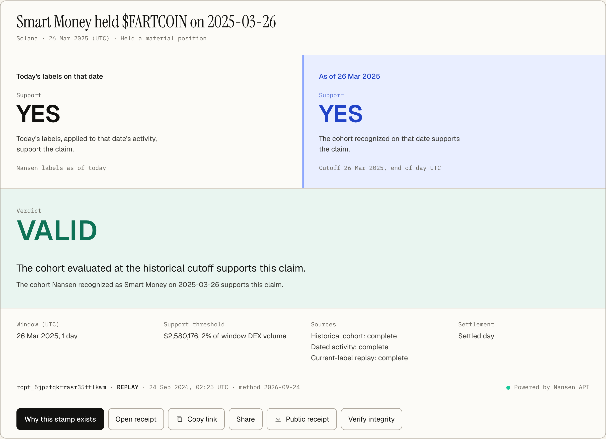

# THEN

**Was this Smart Money then?**

Posts like "Smart Money bought $WIF on June 12" get checked against a dashboard today, and the dashboard applies the Smart Money labels wallets carry *today* to trades from *then*. A wallet that earned the label in August shows up as a Smart Money buyer in June. The claim looks confirmed by wallets nobody could have followed on the day.

THEN rebuilds the claim twice, once with today's labels and once with the cohort Nansen recognized as Smart Money on that date, and stamps it:

- **VALID**: the cohort of the day supports the claim.
- **CONTAMINATED**: only today's labels support it, and wallets labeled after the date account for the difference.
- **INSUFFICIENT**: the dated record cannot decide, so THEN does not guess.

Every stamp writes a signed receipt that anyone can check, in the browser or offline.



THEN does not predict price. VALID means the dated Smart Money cohort supports the claim, not that the trade is good.

## Run it in ten minutes

You need Node 24, pnpm 11, and a [Nansen API key](https://docs.nansen.ai) for new stamps. Stored receipts, verification, and the Challenge work without a key.

```bash
git clone https://github.com/winsznx/then && cd then
cp .env.example .env            # put your key in NANSEN_API_KEY
pnpm install
pnpm test                       # engine, receipts, verifier, parser, store, MCP

# Stamp one claim (about 7 Nansen credits for a buy claim, 3 for a holdings claim)
pnpm then stamp --chain solana --token EKpQGSJtjMFqKZ9KQanSqYXRcF8fBopzLHYxdM65zcjm \
  --date 2026-06-12 --claim SM_BOUGHT --symbol WIF

# Recompute that verdict from the stored Nansen responses, with no network
pnpm then verify receipts/<receipt id>

# The web app on http://localhost:3000
pnpm dev
```

No key yet? Verify a committed synthetic receipt:

```bash
pnpm then verify $(node -p "require('./fixtures/receipts/index.json')[0].receipt_id") --root fixtures/receipts
```

[SETUP.md](SETUP.md) covers every command, configuration value, and the hosted setup.

## What a stamp compares

| | Today's labels | As of the claim date |
|---|---|---|
| Who counts as Smart Money | wallets labeled Smart Money now | wallets Nansen recognized on that date |
| Activity read | the claim's window | the same window |
| Source | current-label endpoints | point-in-time trades and daily holdings snapshots |

A side supports the claim when its Smart Money net flow (for buy and sell claims) or holdings (for hold claims) clears the threshold in the claimed direction. The verdict rule, the threshold per method version, and the evidence THEN asks for before it says CONTAMINATED are in [METHOD.md](METHOD.md).

## Verify a receipt

Each receipt has two layers. The **public receipt** carries the claim, both support states, the verdict, the rule parameters, timestamps, and hashes. The **private bundle** holds every raw Nansen response and never leaves the machine or the server that stamped it.

- In the browser: **Verify integrity** on any receipt page re-runs every public check against the deployment's published keys.
- Offline, public receipt only: `pnpm then verify-public rcpt_x.public.json --keys https://<deployment>/.well-known/then-receipt-keys`
- Offline, with the private bundle: `pnpm then verify <receipt>` recomputes the verdict from the stored responses. `pnpm then ablation <receipt>` removes the point-in-time data and shows the verdict fall to INSUFFICIENT.

## What the corpus shows so far

Forty public Smart Money claims were chosen and frozen on 24 Sep 2026, before THEN produced any verdict ([selection rules](eval/corpus/SELECTION.md)). Measured so far:

- The first run stamped 13 of the 40 before its credit budget ran out; the other 27 were not run for budget reasons only.
- Both reconstructions were complete on 13 of 13.
- The two sides differed by 25% or more on 10 of 13.
- They disagreed on support on 0 of 13, so no verdict changed. Under the threshold used then (2% of the window's DEX volume), neither side of any buy claim could reach support.
- The support rule for buy and sell claims was revised (method 2026-09-24.2) and is being tested on the 27 claims it has not seen. That run has not happened, so **no disagreement rate is claimed**.

Every row and receipt is on the evidence page of the running app (`/corpus`).

## Limits

THEN cannot tell you whether a trade is good, cannot stamp the current UTC day, depends on Nansen's point-in-time endpoints (in beta), and keeps what Nansen returned at stamp time even if Nansen later restates history. Public output never includes wallet addresses, wallet counts, or Smart Money dollar amounts. The full list is in [LIMITATIONS.md](LIMITATIONS.md).

## More

- [ARCHITECTURE.md](ARCHITECTURE.md): packages, the one path from claim to receipt, Nansen endpoints and costs.
- [SECURITY.md](SECURITY.md): what is protected, how, and which test proves it.
- MCP: `pnpm then mcp` serves the `verdict_smart_money_claim` tool to agents over stdio; hosted deployments serve it at `/api/mcp`.

Point-in-time market intelligence powered by the [Nansen API](https://docs.nansen.ai).

## License

[MIT](LICENSE)
